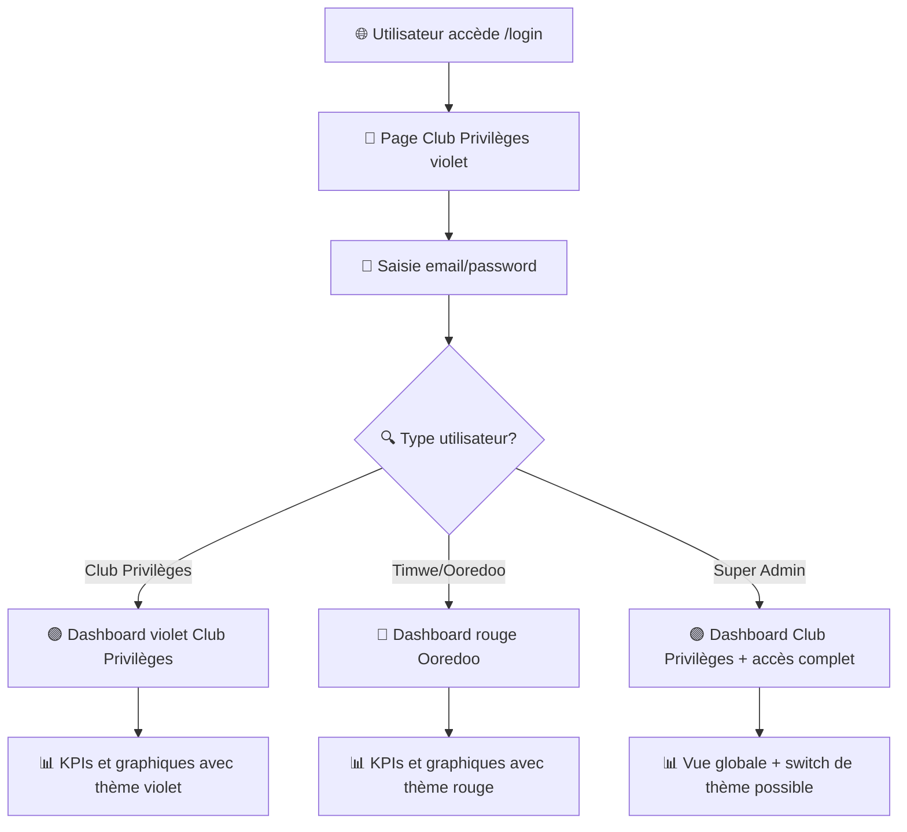

# 🔐 Système d'Authentification Centralisé - Club Privilèges

## 📋 **Vue d'ensemble**

Le système d'authentification a été transformé en une **solution centralisée avec le thème Club Privilèges** qui dispatche automatiquement les utilisateurs vers les bonnes vues selon leur type.

---

## 🎨 **Architecture de l'Authentification**

### **1. Page de Login Centralisée**
- **URL** : `/login`
- **Thème** : Club Privilèges (violet/doré)
- **Design** : Interface moderne avec gradient violet et effets visuels
- **Fonctionnalités** : Login classique + OTP

### **2. Dispatching Automatique**
Après connexion, l'utilisateur est automatiquement redirigé selon son type :

```php
// Utilisateurs Timwe/Ooredoo → Dashboard avec thème rouge Ooredoo
if ($user->isTimweOoredooUser()) {
    return route('dashboard', ['theme' => 'ooredoo']);
}

// Utilisateurs Club Privilèges → Dashboard avec thème violet
return route('dashboard', ['theme' => 'club_privileges']);
```

---

## 👥 **Types d'Utilisateurs**

### **Type 1 : Club Privilèges (`club_privileges`)**
- **Thème** : Violet (#6B46C1) et doré (#F59E0B)
- **Logo** : "Club Privilèges" avec gradient
- **Titre** : "Club Privilèges - Performance Dashboard"

### **Type 2 : Timwe/Ooredoo (`timwe_ooredoo`)**
- **Thème** : Rouge Ooredoo (#E30613)
- **Logo** : Logo Ooredoo classique
- **Titre** : "Ooredoo Privileges - Performance Dashboard"

---

## 🛠 **Implémentation Technique**

### **1. Migration Base de Données**
```sql
ALTER TABLE users ADD COLUMN platform_type ENUM('club_privileges', 'timwe_ooredoo') 
DEFAULT 'club_privileges';
```

### **2. Modèle User (app/Models/User.php)**
```php
// Nouvelles méthodes
public function isClubPrivilegesUser(): bool
public function isTimweOoredooUser(): bool
public function getPreferredDashboard(): string // Dispatching logique
```

### **3. Contrôleur Dashboard**
```php
public function index(Request $request) {
    $theme = $request->get('theme', $user->isTimweOoredooUser() ? 'ooredoo' : 'club_privileges');
    return view('dashboard', compact('theme'));
}
```

### **4. Vue Dashboard Dynamique**
```blade
@php
    $theme = $theme ?? 'club_privileges';
    $isOoredoo = $theme === 'ooredoo';
@endphp

:root {
    @if($isOoredoo)
    --brand-primary: #E30613; /* Rouge Ooredoo */
    @else
    --brand-primary: #6B46C1; /* Violet Club Privilèges */
    @endif
}
```

---

## 🧪 **Utilisateurs de Test Créés**

| Email | Mot de passe | Type | Thème Dashboard |
|-------|-------------|------|-----------------|
| `admin@clubprivileges.com` | `password123` | Club Privilèges | 🟣 Violet/Doré |
| `admin@ooredoo.com` | `password123` | Timwe/Ooredoo | 🔴 Rouge Ooredoo |
| `superadmin@dashboard.com` | `password123` | Super Admin | 🟣 Club Privilèges (défaut) |

---

## 🚀 **Flux d'Authentification**



---

## 🔧 **Configuration et Maintenance**

### **Changer le type de plateforme d'un utilisateur**
```php
$user = User::find(1);
$user->platform_type = 'timwe_ooredoo'; // ou 'club_privileges'
$user->save();
```

### **Créer un nouvel utilisateur Club Privilèges**
```php
User::create([
    'email' => 'newuser@clubprivileges.com',
    'platform_type' => 'club_privileges',
    'role_id' => Role::where('name', 'admin')->first()->id,
    // ... autres champs
]);
```

### **Créer un nouvel utilisateur Timwe/Ooredoo**
```php
User::create([
    'email' => 'newuser@ooredoo.com',
    'platform_type' => 'timwe_ooredoo',
    'role_id' => Role::where('name', 'admin')->first()->id,
    // ... autres champs
]);
```

---

## 🎯 **Avantages de cette Architecture**

1. **🎨 Branding Unifié** : Page de login avec identité Club Privilèges
2. **🔄 Dispatching Intelligent** : Redirection automatique selon le type d'utilisateur
3. **⚙️ Maintenance Simplifiée** : Un seul point d'entrée, thèmes gérés dynamiquement
4. **🔒 Sécurité Centralisée** : Logique d'authentification unifiée
5. **📱 Évolutivité** : Facile d'ajouter de nouveaux types de plateformes

---

## 🚨 **Points d'Attention**

- **Rétrocompatibilité** : Les anciennes variables CSS (`--brand-red`) pointent vers `--brand-primary`
- **Données existantes** : Les utilisateurs existants sont automatiquement `club_privileges` par défaut
- **Session Management** : Le thème est déterminé à chaque connexion selon le type d'utilisateur
- **Performance** : Le thème est calculé côté serveur, pas de JavaScript supplémentaire

---

## 📞 **Support et Documentation**

Pour toute question ou modification :
1. Vérifiez la migration `2025_08_20_221446_add_platform_type_to_users_table.php`
2. Consultez les méthodes dans `app/Models/User.php`
3. Testez avec les utilisateurs créés via `create_test_users.php`

**🎉 Le système est maintenant opérationnel et prêt pour la production !**

