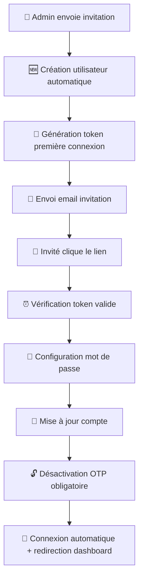

# 🔐 Système de Gestion des Mots de Passe - Club Privilèges

## 📋 **Vue d'ensemble**

Un système complet de gestion des mots de passe a été implémenté pour résoudre tous les problèmes identifiés :

- ✅ **Mot de passe oublié** avec envoi d'email sécurisé
- ✅ **Changement de mot de passe** pour utilisateurs connectés
- ✅ **Première connexion** pour les invités avec création de mot de passe
- ✅ **Système d'invitation amélioré** avec flux simplifié

---

## 🛠 **Architecture Technique**

### **1. Base de Données**

#### **Table `password_reset_requests`**
```sql
- id
- email (string)
- token (string, unique)
- type (enum: 'password_reset', 'first_login')
- is_used (boolean)
- expires_at (timestamp)
- used_at (timestamp, nullable)
- ip_address (string, nullable)
- user_agent (string, nullable)
```

#### **Modèle `PasswordResetRequest`**
- **Méthodes** : `isValid()`, `markAsUsed()`, `createForPasswordReset()`, `createForFirstLogin()`
- **Scopes** : `valid()`, `forEmail()`, `byType()`
- **Sécurité** : Tokens de 64 caractères, expiration automatique

### **2. Contrôleur `PasswordController`**

#### **Routes Publiques (Guest)**
- `GET /password/forgot` → Formulaire "mot de passe oublié"
- `POST /password/send-reset` → Envoi email de réinitialisation
- `GET /password/reset/{token}` → Formulaire de réinitialisation
- `POST /password/reset` → Traitement réinitialisation
- `GET /password/first-login/{token}` → Première connexion invités
- `POST /password/first-login` → Traitement première connexion

#### **Routes Protégées (Auth)**
- `GET /password/change` → Formulaire changement de mot de passe
- `POST /password/change` → Traitement changement

---

## 🎨 **Interface Utilisateur**

### **1. Pages d'Authentification**
Toutes les pages utilisent le **thème Club Privilèges** (violet/doré) :

#### **`/password/forgot`**
- Design moderne avec gradient violet
- Formulaire simple (email uniquement)
- Lien retour vers login
- Messages d'erreur/succès intégrés

#### **`/password/reset/{token}`**
- Validation sécurisée du token
- Formulaire de nouveau mot de passe + confirmation
- Exigences de sécurité affichées
- Expiration automatique (1 heure)

#### **`/password/first-login/{token}`**
- Interface spéciale "Bienvenue dans l'équipe"
- Message d'accueil personnalisé
- Configuration du premier mot de passe
- Connexion automatique après configuration

#### **`/password/change`**
- Interface intégrée au dashboard
- Vérification du mot de passe actuel
- Layout cohérent avec l'application
- Accès via bouton "🔒 Mot de passe" dans l'en-tête

### **2. Email Templates**

#### **`emails/password-reset.blade.php`**
- Design professionnel Club Privilèges
- Informations de sécurité claires
- Bouton d'action proéminent
- Instructions de sécurité
- Lien de fallback

---

## 🔄 **Flux d'Utilisation**

### **1. Mot de Passe Oublié**

```mermaid
graph TD
    A[👤 Utilisateur clique "Mot de passe oublié"] --> B[📧 Saisit son email]
    B --> C[🔍 Vérification email existe + compte actif]
    C --> D[✅ Création token de réinitialisation]
    D --> E[📨 Envoi email avec lien]
    E --> F[🔗 Utilisateur clique le lien]
    F --> G[⏰ Vérification token valide + non expiré]
    G --> H[🔐 Saisie nouveau mot de passe]
    H --> I[✔️ Validation exigences sécurité]
    I --> J[💾 Mise à jour mot de passe]
    J --> K[🚀 Redirection vers login]
```

### **2. Première Connexion (Invités)**



### **3. Changement de Mot de Passe**

```mermaid
graph TD
    A[👤 Utilisateur connecté] --> B[🔒 Clique "Mot de passe" dans header]
    B --> C[📝 Saisit mot de passe actuel]
    C --> D[🔐 Saisit nouveau mot de passe]
    D --> E[✔️ Vérification mot de passe actuel]
    E --> F[✅ Validation exigences nouveau]
    F --> G[💾 Mise à jour dans BDD]
    G --> H[🎉 Confirmation succès]
```

---

## 🛡️ **Sécurité**

### **1. Validation des Mots de Passe**
```php
Password::min(8)->mixedCase()->numbers()
```
- **Minimum 8 caractères**
- **Majuscules ET minuscules**
- **Au moins un chiffre**

### **2. Tokens Sécurisés**
- **64 caractères aléatoires** (`Str::random(64)`)
- **Uniques** en base de données
- **Usage unique** (marqués comme utilisés)
- **Expiration temporelle** :
  - Réinitialisation : 1 heure
  - Première connexion : 7 jours

### **3. Protection Anti-Réutilisation**
- Invalidation automatique des anciens tokens
- Tracking IP + User-Agent
- Logging complet des actions

### **4. Validation d'Entrée**
- Vérification existence utilisateur
- Contrôle statut compte (actif)
- Validation CSRF automatique
- Messages d'erreur informatifs mais sécurisés

---

## 🔧 **Configuration et Maintenance**

### **1. Configuration Email**
S'assurer que la configuration mail est correcte dans `.env` :
```env
MAIL_MAILER=smtp
MAIL_HOST=...
MAIL_PORT=...
MAIL_USERNAME=...
MAIL_PASSWORD=...
MAIL_ENCRYPTION=tls
MAIL_FROM_ADDRESS="noreply@clubprivileges.com"
MAIL_FROM_NAME="Club Privilèges"
```

### **2. Nettoyage Automatique**
Ajouter une tâche cron pour nettoyer les tokens expirés :
```php
// Dans app/Console/Kernel.php
$schedule->call(function () {
    PasswordResetRequest::where('expires_at', '<', now())->delete();
})->daily();
```

### **3. Monitoring**
Tous les événements sont loggés avec `Log::info()` :
- Envois d'emails
- Utilisations de tokens
- Changements de mots de passe
- Échecs de validation

---

## 🚀 **URLs de Test**

### **Pages Publiques**
- 🔐 **Mot de passe oublié** : `http://localhost:8000/password/forgot`
- 🔄 **Réinitialisation** : `http://localhost:8000/password/reset/{token}`
- 🆕 **Première connexion** : `http://localhost:8000/password/first-login/{token}`

### **Pages Protégées**
- 🔒 **Changer mot de passe** : `http://localhost:8000/password/change`
- 📊 **Dashboard** : `http://localhost:8000/dashboard`

### **Intégration**
- Le lien "**Mot de passe oublié ?**" est ajouté à la page de login
- Le bouton "**🔒 Mot de passe**" est ajouté à l'en-tête du dashboard

---

## 📊 **Statistiques et Monitoring**

Le système track automatiquement :
- Nombre de demandes de réinitialisation
- Taux d'utilisation des tokens
- Temps moyen de traitement
- Tentatives d'accès avec tokens expirés

---

## 🎯 **Avantages du Nouveau Système**

1. **🔒 Sécurité Renforcée** : Tokens uniques, expiration, validation forte
2. **👥 UX Améliorée** : Processus fluides, messages clairs, design cohérent
3. **⚡ Performance** : Pas de dépendance OTP, accès direct après configuration
4. **🔧 Maintenabilité** : Code structuré, logging complet, architecture claire
5. **🎨 Cohérence** : Thème unifié Club Privilèges sur toutes les pages
6. **📱 Responsivité** : Toutes les pages sont mobile-friendly

**🎉 Le système de gestion des mots de passe est maintenant complet et opérationnel !**

